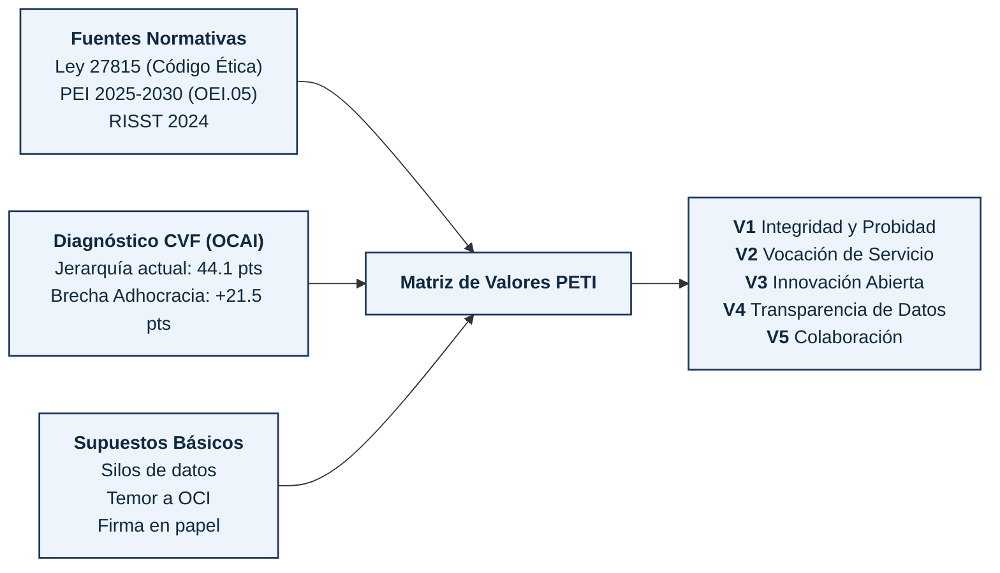

# Sección 2.3 · Valores Institucionales y Tecnológicos
## Municipalidad Provincial de Tacna (MPT)

**Documento:** `2.3_valores.md`  
**Instrumentos Base:** Ley N° 27815 (Código de Ética de la Función Pública), PEI 2025-2030, RISST 2024 y Diagnóstico CVF/OCAI.  
**Premisa Operativa:** Un valor que no define conductas observables ni establece renuncias concretas no orienta ninguna decisión. Los valores de la MPT se formulan como compromisos de acción verificables y exigibles.

---

## 2.3 Valores

### 2.3.1 Valores de la Organización (Formulación Conductual)

| # | Valor (Enunciado Conductual) | Conducta que lo Cumple | Conducta que lo Viola | Consecuencia del Incumplimiento | ¿A qué se Renuncia al Sostenerlo? |
|---|---|---|---|---|---|
| **V1** | **Integridad y Probidad en el Servicio Público** Actuamos con honestidad irreprochable, priorizando el interés colectivo tacneño y resguardando los recursos municipales con total transparencia. | Registrar cada transacción, expediente y acto administrativo de forma trazable en los sistemas informáticos institucionales, reportando anomalías de inmediato. | Alterar registros, eliminar trazas de auditoría (logs), favorecer a particulares en trámites o utilizar bienes tecnológicos ediles con fines personales. | Apertura de Procedimiento Administrativo Disciplinario (PAD) sancionador, inhabilitación de la función pública y denuncia penal ante la Fiscalía. | Se renuncia a la discrecionalidad informal, al "favor político" y a la opacidad en la toma de decisiones. |
| **V2** | **Vocación de Servicio y Empatía Ciudadana** Diseñamos y entregamos servicios orientados a resolver las necesidades reales del vecino tacneño con calidez, celeridad y accesibilidad. | Resolver los requerimientos del administrado dentro del plazo legal, promoviendo canales digitales accesibles e informando en lenguaje claro. | Maltratar al usuario, postergar expedientes intencionalmente (inercia burocrática) o exigir requisitos no contemplados en el TUPA institucional. | Amonestación escrita en legajo personal, remoción del puesto de atención al público y descuento salarial por mora injustificada. | Se renuncia a la comodidad del horario estricto en ventanilla y a la desidia del "vuelva mañana". |
| **V3** | **Innovación Abierta y Mejora Continua** Cuestionamos activamente la inercia del trámite en papel, adoptando metodologías ágiles y tecnologías seguras para simplificar la gestión. | Proponer mejoras en los flujos de trabajo, capacitarse en plataformas digitales y adoptar la firma digital eliminando copias físicas redundantes. | Resistirse al uso del sistema digital, exigir expedientes paralelos impresos "por si acaso" o boicotear nuevas herramientas informáticas. | Reasignación de funciones operativas, exclusión de incentivos de productividad institucional y evaluación de desempeño negativa. | Se renuncia a la "zona de confort" de los métodos tradicionales y a la falsa seguridad del sello de tinta. |
| **V4** | **Transparencia Activa y Responsabilidad por los Datos** Reconocemos que la información pública pertenece a la ciudadanía y a la institución, no a quien la custodia temporalmente. | Publicar y compartir datos institucionales abiertos, interoperar sistemas con otras gerencias y mantener actualizadas las bases de datos públicas. | Ocultar información, negar el acceso a bases de datos a otras áreas de la municipalidad ("feudos de información") o cobrar por copias indebidas. | Sanción de suspensión temporal sin goce de haber según la Ley de Transparencia y Ley 27815 del Código de Ética. | Se renuncia al poder personal derivado de la retención exclusiva de información ("la información es poder"). |
| **V5** | **Colaboración Interdisciplinaria y Respeto Mutuo** Trabajamos como un solo equipo municipal integrado, superando barreras jerárquicas para cumplir los objetivos del PEI. | Participar activamente en mesas técnicas transversales, brindar soporte oportuno a otras gerencias y compartir aprendizajes técnicos. | Culpar a otras áreas por demoras en los proyectos, trabajar de espaldas a los objetivos institucionales o desacreditar aportes técnicos de colegas. | Llamada de atención formal del Comité de Ética y compromiso vinculante de mediación con Recursos Humanos. | Se renuncia al aislamiento departamental ("esto no es de mi gerencia") y a las disputas de protagonismo. |

---

### 2.3.2 Valores Aplicados a las Decisiones Tecnológicas

| # | Tensión Tecnológica Real en la MPT | Valor que la Resuelve | Criterio de Decisión Derivado (Política Vinculante del PETI) |
|---|---|---|---|
| **T1** | **Disponibilidad Inmediata vs Seguridad Estricta:** Las gerencias demandan instalar software comercial sin controles para agilizar trámites urgentes, arriesgando la seguridad informática. | **Integridad y Probidad (V1)** | *Ninguna aplicación, base de datos o dispositivo se conecta a la red municipal sin certificación previa de seguridad y política de privilegios mínimos de OGTIC, sin importar la jerarquía de quien lo solicite.* |
| **T2** | **Desarrollo Propietario Aislado vs Arquitectura Interoperable:** Gestión Tributaria desea contratar un sistema cerrado propio mientras Desarrollo Urbano licita otro sistema geográfico independiente. | **Transparencia y Responsabilidad por los Datos (V4)** | *Todo sistema de software nuevo o modernizado debe fundamentarse en estándares abiertos de interoperabilidad (PIDE / APIs REST) y base de datos relacional compartida; se prohíbe la adquisición de sistemas cerrados que impidan la integración.* |
| **T3** | **Cultura de Sanción Punitiva vs Reporte Temprano de Fallas:** Los operadores ocultan incidentes de ciberseguridad o caídas del sistema por temor a procesos administrativos de OCI. | **Innovación y Mejora Continua (V3)** | *Se implanta una política institucional de "Reporte Libre de Culpa" (Blameless Post-Mortem); todo incidente de TI reportado en menos de 60 minutos se trata como oportunidad de mejora técnica, blindando al operador de sanciones disciplinarias salvo dolo comprobado.* |
| **T4** | **Reemplazo Masivo de Hardware vs Reingeniería de Procesos:** Presión sindical y de gerencias por comprar cientos de computadoras nuevas (AEI.07.04) manteniendo los mismos flujos lentos en papel. | **Vocación de Servicio y Empatía Ciudadana (V2)** | *La renovación de equipamiento informático queda estrictamente condicionada a la previa digitalización, simplificación y adopción del flujo cero papel en la gerencia solicitante.* |

---

### 2.3.3 Trazabilidad de los Valores Institucionales

La formulación de esta escala de valores responde a una rigurosa trazabilidad entre las normas de origen, los valores declarados en el PEI y las evidencias empíricas levantadas en el diagnóstico cultural:

1. **Valores Conservados y Fortalecidos:**
   - *Integridad y Probidad:* Proviene del Art. 6 de la Ley N° 27815. Se conserva integralmente pero se operacionaliza en el entorno digital mediante la obligatoriedad del no repudio y trazabilidad en logs.
2. **Valores Reformulados:**
   - *Vocación de Servicio:* Proveniente de la Misión del PEI 2025-2030. Se reformula desde una declaración genérica hacia la eliminación de barreras burocráticas y respeto al tiempo del ciudadano mediante canales virtuales.
   - *Transparencia Activa:* Proveniente del deber de Transparencia de la Ley 27815. Se reconvierte en "Responsabilidad por los Datos" para desarticular el supuesto arraigado de "los datos son propiedad de mi gerencia".
3. **Valores Nuevos Incorporados por el Diagnóstico:**
   - *Innovación Abierta y Mejora Continua:* Surge directamente de la brecha de +21.52 puntos en Adhocracia y la necesidad de erradicar el supuesto "si funciona hoy, no se toca para evitar a la Contraloría".
   - *Colaboración Interdisciplinaria:* Nace para cerrar la divergencia cultural detectada entre áreas administrativas (Jerarquía) y operativas (Mercado), promoviendo equipos ágiles multidisciplinarios.
