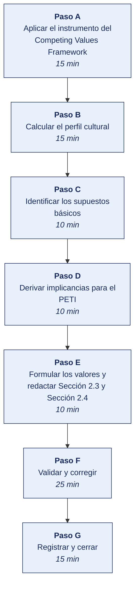

[Semana 05](README.md) · [Teoría](1-TEORIA.md) · [Dinámica de aula](2-DINAMICA.md) · **Taller de laboratorio**

# Taller de laboratorio 05 · Diagnóstico de cultura con el Competing Values Framework

**SI-886 · Planeamiento Estratégico de TI** · Semana 05 · Sesión 2 en laboratorio · 100 min · calificación **procedimental**

> ¿Un término no le resulta claro? Está definido en el [glosario técnico del curso](../GLOSARIO.md).

---

## Secuencia del taller



## Qué entregas

| | |
|---|---|
| **Archivo** | `SI886-S05-TALLER-Grupo<N>.pdf` |
| **Plantilla obligatoria** | [SI886-PLANTILLA-TALLER.docx](../PLANTILLAS/SI886-PLANTILLA-TALLER.docx) |
| **Formato** | PDF exportado desde la plantilla en Word, con la carátula de la UPT, el índice actualizado y las capturas numeradas |
| **Qué va dentro** | Las secciones de la plantilla. La **5. Resultados y evidencias** se califica contra la tabla de resultados esperados de esta guía, y **cada resultado necesita la evidencia que lo demuestre**. No se copian de aquí los objetivos, la duración ni los resultados de aprendizaje |
| **Dónde se sube** | Aula virtual, tarea «Taller · Semana 05» |
| **Cuándo vence** | 48 horas después de la sesión de laboratorio |

> No se califica un informe entregado en `.docx`, sin carátula, sin los códigos de los integrantes o con resultados declarados sin evidencia.

---

## El reto

| | |
|---|---|
| **Situación** | La transformación digital que el plan propondrá choca con la cultura que la organización tiene hoy, y nadie ha medido cuál es. |
| **Misión** | Medir el perfil de cultura actual y el deseado con el Competing Values Framework, y calcular la brecha por dimensión. |
| **Criterio de éxito** | La brecha está calculada sobre respuestas reales, no supuestas, y se identifica cuál dimensión bloquea el plan. |

## 1. Información sobre el evento práctico

### 1.1. Objetivos

- Aplicar un **instrumento de diagnóstico de cultura** basado en el Competing Values Framework.
- Determinar el **perfil de cultura actual y deseada** y calcular la brecha por dimensión.
- Identificar los **supuestos básicos** mediante análisis de artefactos y de discurso.
- Detectar la **brecha entre valores adoptados y conducta observada**.
- Derivar las **implicancias del perfil cultural para la implantación del PETI**.
- Formular los **valores conductuales** de la organización y redactar Sección 2.3 y Sección 2.4.

### 1.2. Recursos

| Recurso | Detalle |
|---|---|
| **LimeSurvey** o Google Forms | Aplicación del instrumento |
| **Python 3.11+** con `pandas`, `matplotlib`, `numpy` | Cálculo y gráfico de radar |
| Muestra del personal de la organización | Base de respondientes del instrumento |
| Documentación de la organización | Código de conducta, reglamento interno, comunicaciones |
| **draw.io** | Mapa de artefactos |
| Cameron y Quinn, *Diagnosing and Changing Organizational Culture* | Referencia metodológica |

### 1.3. Seguridad

1. El instrumento es **anónimo**. No se solicita ningún dato que permita identificar al respondiente; el área se registra solo si tiene al menos cinco respondientes, para evitar la reidentificación.
2. Los resultados se entregan a la organización **agregados**. Nunca se comparten respuestas individuales.
3. El diagnóstico de cultura puede revelar tensiones internas. Se informa a la organización **antes** de aplicarlo, y se acuerda cómo se comunicarán los resultados.
4. El equipo formulador **no emite juicios sobre personas ni sobre la gestión**. Describe el perfil cultural y sus implicancias para el plan.
5. Los datos se conservan cifrados y se eliminan al cierre del semestre, dejando registro.

---

## 2. Procedimiento o Metodología

> **Documento del caso para esta semana.** La organización entrega **Organigrama y estructura**, en `CASOS/EMPRESA-<NN>-<slug>/documentos/organigrama-y-accesos.md`. Es consistente con los datos de `datos/`. Las personas, usuarios y proveedores que menciona existen en los archivos. **No señala sus debilidades**; declara lo que la organización dice hacer.

### Paso A — Aplicar el instrumento del Competing Values Framework

El instrumento presenta **seis dimensiones**; en cada una, el respondiente **reparte 100 puntos** entre cuatro afirmaciones (A = Clan, B = Adhocracia, C = Mercado, D = Jerarquía), **dos veces**. Como es **hoy** y como debería ser **en cinco años**.

`02_identidad/CU01_instrumento.md` — las seis dimensiones:

| # | Dimensión | A (Clan) | B (Adhocracia) | C (Mercado) | D (Jerarquía) |
|---|---|---|---|---|---|
| 1 | **Características dominantes** | Es como una familia; la gente comparte mucho de sí | Es dinámica y emprendedora; la gente asume riesgos | Está orientada a resultados; lo que importa es cumplir la meta | Es un lugar controlado y estructurado; los procedimientos gobiernan |
| 2 | **Liderazgo** | Los líderes son mentores y facilitadores | Los líderes son innovadores y toman riesgos | Los líderes son exigentes y orientados a resultados | Los líderes son coordinadores y organizadores |
| 3 | **Gestión del personal** | Se caracteriza por el trabajo en equipo y la participación | Se caracteriza por la libertad y la iniciativa individual | Se caracteriza por la competencia y la exigencia | Se caracteriza por la estabilidad y la predictibilidad |
| 4 | **Cohesión** | La lealtad y la confianza mutua | El compromiso con la innovación y el desarrollo | El logro de metas y objetivos agresivos | Las reglas y las políticas formales |
| 5 | **Énfasis estratégico** | El desarrollo humano, la confianza y la apertura | La adquisición de nuevos recursos y desafíos | La acción competitiva y el logro de objetivos | La permanencia y la estabilidad |
| 6 | **Criterio de éxito** | El desarrollo de las personas y el trabajo en equipo | Tener los productos más nuevos y únicos | Ganar en el mercado y superar a la competencia | La eficiencia, la confiabilidad y el bajo costo |

> **Regla de aplicación.** La suma de A + B + C + D debe ser **exactamente 100** en cada dimensión y en cada momento. El instrumento fuerza la elección. No se puede valorar todo por igual, que es precisamente el punto.

### Paso B — Calcular el perfil cultural

**El programa está en [`HERRAMIENTAS/SEMANA-05/CU02_perfil_cultura.py`](../HERRAMIENTAS/SEMANA-05/CU02_perfil_cultura.py).** Se copia al repositorio del equipo como `02_identidad/CU02_perfil_cultura.py` y **se edita con los datos de su organización**. El programa hace el cálculo, las cifras y su justificación son del equipo.

```bash
cp ../HERRAMIENTAS/SEMANA-05/CU02_perfil_cultura.py 02_identidad/CU02_perfil_cultura.py
python3 02_identidad/CU02_perfil_cultura.py
```

### Paso C — Identificar los supuestos básicos

Los supuestos no se preguntan directamente. Se **infieren** de artefactos y de discurso.

`02_identidad/CU03_supuestos.csv`:

| # | Artefacto o hecho observado | Fuente | Valor adoptado que la organización declara | **Supuesto básico que revela** | ¿Coinciden? |
|---|---|---|---|---|---|
| 1 | Ningún proyecto se aprueba sin firma del gerente general, incluso por S/ 2 000 | Observación y entrevista | «Autonomía y empoderamiento» | «Las decisiones las toma una sola persona» | **No** |
| 2 | El registro de incidentes tiene 3 entradas en 12 meses en una organización de 64 personas | Documental | «Mejora continua» | «Reportar un error trae consecuencias» | **No** |
| 3 | Cada área mantiene su propia hoja de cálculo de clientes | Observación | «Trabajo en equipo» | «La información es fuente de poder del área» | **No** |
| 4 | El servidor del ERP corre un sistema operativo fuera de soporte | Documental | «Excelencia operativa» | «Si funciona, no se toca» | **No** |
| 5 | Las reuniones empiezan puntualmente y hay acta de cada una | Observación | «Orden y disciplina» | Coincide | **Sí** |

**Análisis de discurso.** Se revisan comunicaciones internas, el reglamento interno y el código de conducta, buscando — qué se premia, qué se sanciona, qué se menciona con frecuencia y **qué nunca se menciona**. Lo ausente suele ser más revelador que lo presente.

### Paso D — Derivar implicancias para el PETI

`02_identidad/CU04_implicancias_peti.md` — la tabla que hace útil el diagnóstico:

| Hallazgo cultural | Riesgo para la implantación del PETI | Estrategia de implantación que se adopta | Sección del plan donde se materializa |
|---|---|---|---|
| Cultura dominante **Jerarquía** (42 puntos) | Los proyectos que no estén formalmente normados no se adoptarán, aunque sean mejores | Cada proyecto del portafolio incluye la **directiva o procedimiento** que lo formaliza, aprobado por la gerencia | Sección 7 Portafolio · Sección 10 Implementación |
| Deseo de mayor **Adhocracia** (+14 en la brecha) | Existe apetito de cambio no canalizado; puede derivar en herramientas paralelas no gobernadas | Crear un mecanismo formal de propuesta e incubación de iniciativas, con gobierno del dato | Sección 6.2 Objetivos · Sección 7 Portafolio |
| Supuesto «la información es del área» | Los proyectos de integración y de analítica encontrarán resistencia pasiva | Proyecto de **gobierno del dato** con dueños de dato designados formalmente, **antes** de los proyectos de analítica | Sección 7.3 Hoja de ruta — secuencia |
| Supuesto «el error se castiga» | El registro de incidentes seguirá vacío; no habrá insumo para mejorar | Incorporar un mecanismo de reporte sin atribución de culpa, respaldado por la gerencia | Sección 10 Implementación · Gestión del cambio |
| Perfil divergente entre Ventas (Mercado) y Administración (Jerarquía) | Un mismo proyecto se recibirá de forma opuesta según el área | **Comunicación diferenciada.** Caso de negocio con métricas para Ventas; procedimiento y norma para Administración | Sección 10 Matriz de comunicaciones |

### Paso E — Formular los valores y redactar Sección 2.3 y Sección 2.4

`02_identidad/2.3_valores.md`:

```markdown
## 2.3 Valores

### 2.3.1 Valores de la organización
| Valor (enunciado conductual) | Conducta que lo cumple | Conducta que lo viola | Consecuencia del incumplimiento | ¿A qué se renuncia al sostenerlo? |

### 2.3.2 Valores aplicados a las decisiones tecnológicas
| Tensión | Valor que la resuelve | Criterio de decisión derivado |

### 2.3.3 Trazabilidad
Origen de cada valor: valores vigentes conservados, valores reformulados y valores nuevos,
con la evidencia del diagnóstico de cultura que sustenta cada incorporación.
```

### Paso F — Validar y corregir (25 min)

El resultado no vale por estar hecho, sino por resistir una comprobación. Se ejecutan estas tres y **se corrige lo que falle antes de cerrar la sesión**.

1. Comprobar que el instrumento se aplicó a personas de más de un área, no solo a TI.
2. Verificar que los cuatro perfiles suman lo que deben sumar en cada bloque del instrumento.
3. Contrastar la dimensión de mayor brecha con una decisión real de la organización que la confirme.

> Lo que no se pueda corregir hoy se anota en la sección **Problemas y mejoras** de la evidencia, con lo que faltó y por qué. Un resultado parcial documentado con honestidad vale más que uno declarado sin prueba.

`02_identidad/2.4_cultura.md`:

```markdown
## 2.4 Diagnóstico de cultura organizacional

### 2.4.1 Metodología
Instrumento aplicado, población, muestra, tasa de respuesta y control de calidad de las
respuestas. Limitaciones del diagnóstico.

### 2.4.2 Perfil de cultura actual y deseada
Gráfico de radar, tabla de puntajes por tipo y análisis de la brecha.

### 2.4.3 Congruencia cultural
Análisis por dimensión y por área; identificación de las divergencias internas.

### 2.4.4 Supuestos básicos identificados
Tabla de artefactos, valores adoptados y supuestos inferidos, con la brecha señalada.

### 2.4.5 Implicancias para la implantación del plan
Tabla de hallazgo cultural → riesgo → estrategia de implantación → sección del plan.
**Esta tabla condiciona la secuencia de la hoja de ruta (Sección 7.3) y la matriz de
comunicaciones (Sección 10).**
```

### Paso G — Registrar la evidencia y cerrar (15 min)

Se versiona lo producido, se anota la URL de cada resultado y se responde en dos frases la pregunta de transferencia — **qué riesgo correría una organización real si esto se hiciera mal**.

```bash
git add . && git commit -m "S05: valores conductuales y diagnostico de cultura — secciones 2.3 y 2.4"
git tag -a v0.5 -m "PETI v0.5 — identidad estrategica completa"
```

---

## 3. Resultados

> **Evidencia obligatoria en GitHub.** Todo resultado de este taller se versiona en el repositorio del equipo. El informe **no consigna capturas sueltas**. Consigna la **URL** del artefacto en GitHub. Una captura no permite verificar autoría, fecha ni contenido; un enlace sí.
>
> | Qué se entrega | Dónde vive | Qué se escribe en el informe |
> |---|---|---|
> | Código y archivos de configuración | Rama del taller, fusionada a `develop` vía Pull Request | URL del Pull Request |
> | Documentos y matrices | `docs/`, en formato de texto versionable | URL del archivo en la rama |
> | Capturas y videos que el taller exija | `docs/evidencias/S05/` | URL del archivo |
> | Salida de comandos | `docs/evidencias/S05/salidas/*.txt` | URL del archivo |
>
> **Etiqueta del taller.** Al cerrar el taller se crea la etiqueta `taller-05` sobre el commit entregado:
>
> ```bash
> git tag -a taller-05 -m "Taller 05 · SI886"
> git push origin taller-05
> ```
>
> La URL que se consigna en el informe apunta a esa etiqueta:
> `https://github.com/<organizacion>/<repositorio>/tree/taller-05`
>
> **El informe es lo que se califica; el repositorio es lo que lo prueba.** Cada resultado de la sección 3 del informe lleva la URL con la que se verifica, y **un resultado sin su URL se califica como no logrado**, por bien redactado que esté. Lo que no se puede abrir no se puede dar por hecho.

### 3.1. Los tres resultados que se califican

Son los que la rúbrica evalúa. El resto de la lista tiene que existir, pero no se califica fila por fila.

| Resultado | Qué demuestra | Dónde está |
|---|---|---|
| **El perfil medido** | Actual y deseado, sobre respuestas reales de más de un área | Radar de cultura |
| **La brecha por dimensión** | Calculada, con la dimensión crítica identificada | Tabla de brechas |
| **La consecuencia para el plan** | Qué proyecto del plan peligra por esa brecha | Sección 2.3 |

### 3.2. Lista de comprobación del taller

Todo esto debe existir al cerrar la sesión.

| # | Resultado esperado | Verificación |
|---|---|---|
| 1 | Instrumento del CVF aplicado con las **seis dimensiones** y los dos momentos | `CU01_instrumento.md` |
| 2 | **Al menos 10 respondientes o el 30 % del personal**, lo que sea mayor | `encuesta_cultura.csv` |
| 3 | **Control de calidad ejecutado.** Respuestas cuya suma no es 100 excluidas y reportadas | Salida del script |
| 4 | Perfil de cultura actual y deseada calculado, con la brecha por tipo | `CU02_perfil_cultura.csv` |
| 5 | **Cultura dominante y cultura deseada identificadas** con su puntaje | Salida del script |
| 6 | **Análisis de congruencia** por dimensión, con el veredicto | Salida del script |
| 7 | Perfil por área (áreas con ≥ 5 respondientes), con las divergencias identificadas | Salida del script |
| 8 | Gráfico de radar generado | `CU_perfil_cultura.png` |
| 9 | **Al menos 5 supuestos básicos** inferidos de artefactos, con su evidencia | `CU03_supuestos.csv` |
| 10 | **Al menos 3 brechas** entre valor adoptado y supuesto básico | `CU03_supuestos.csv` |
| 11 | Tabla de implicancias con **estrategia de implantación por hallazgo cultural** | `CU04_implicancias_peti.md` |
| 12 | Valores formulados **como conductas**, con conducta que cumple, que viola, consecuencia y renuncia | Sección 2.3 |
| 13 | Al menos un valor que gobierne una **decisión tecnológica** concreta | Sección 2.3.2 |
| 14 | Secciones Sección 2.3 y Sección 2.4 redactadas · etiqueta `v0.5` | `git tag` |

## Rúbrica procedimental (20 puntos)

Se aplica sobre el informe entregado y la evidencia enlazada en el repositorio. **Cada criterio se califica de forma independiente.**

| Criterio | 4 — Logrado | 2 — En proceso | 0 — Insuficiente |
|---|---|---|---|
| **El criterio de éxito** | Se cumple tal como lo pide el reto de esta sesión | Se cumple con reservas que el equipo declara | No se cumple, o se afirma cumplido sin prueba |
| **El perfil medido** | Completo y correcto, con la evidencia que lo respalda | Completo con errores menores, o correcto sin toda la evidencia | Incompleto o sin evidencia |
| **La brecha por dimensión** | Completo y correcto, con la evidencia que lo respalda | Completo con errores menores, o correcto sin toda la evidencia | Incompleto o sin evidencia |
| **La consecuencia para el plan** | Completo y correcto, con la evidencia que lo respalda | Completo con errores menores, o correcto sin toda la evidencia | Incompleto o sin evidencia |
| **La validación** | Las tres comprobaciones ejecutadas, y lo que falló quedó corregido o documentado | Ejecutadas sin corregir lo que falló | No se validó nada |

| Puntaje | Equivalencia |
|---|---|
| 18 – 20 | Destacado |
| 14 – 17 | Logrado |
| 6 – 13 | En proceso |
| 0 – 5 | Insuficiente |

> **Un resultado declarado sin evidencia enlazada no se califica**, aunque el trabajo se haya hecho. La tabla de la sección 3.1 es la lista de cotejo; esta rúbrica es lo que determina la nota.

## 4. Conclusiones

Mínimo tres. Líneas argumentales esperadas:

1. Cuando los valores adoptados y los supuestos básicos se contradicen, gobiernan los supuestos; un PETI que ignora esa brecha diseña una implantación para una organización que no existe.
2. El perfil cultural determina cómo debe presentarse e implantarse cada proyecto. El mismo proyecto requiere directiva formal en una cultura de jerarquía y participación temprana en una de clan.
3. Un valor que no implica renunciar a nada no orienta ninguna decisión; formularlo como conducta observable con su consecuencia es lo que lo vuelve exigible y, por tanto, útil para gobernar las decisiones tecnológicas.

## 5. Referencias Bibliográficas

- López Posada, L. M. (2016). *Cultura organizacional: entre el individualismo y el colectivismo*. Sello Editorial Universidad del Tolima. https://elibro.net/es/ereader/bibliotecaupt/71071
- Cameron, K. S. y Quinn, R. E. (2011). *Diagnosing and Changing Organizational Culture: Based on the Competing Values Framework* (3.ª ed.). Jossey-Bass.
- Schein, E. H. y Schein, P. (2017). *Organizational Culture and Leadership* (5.ª ed.). Wiley.
- González Millán, J. (2020). *Manual práctico de planeación estratégica*. Ediciones Díaz de Santos. https://elibro.net/es/lc/bibliotecaupt/titulos/129291
- Rodríguez Bermúdez, J. R. (2015). *Usos estratégicos de las TIC*. Editorial UOC. https://elibro.net/es/lc/bibliotecaupt/titulos/57677
- Kotter, J. P. (2012). *Leading Change*. Harvard Business Review Press.
- ISACA. (2018). *COBIT 2019*, componente «Cultura, ética y comportamiento». https://www.isaca.org/resources/cobit
- Ley 29733 y D. S. 016-2024-JUS — tratamiento de datos en instrumentos de diagnóstico. https://www.gob.pe/institucion/anpd

## 6. Anexos

- `anexo_A_instrumento_cvf.pdf`
- `anexo_B_resultados_cultura.xlsx`
- `anexo_C_perfil_cultura.png`
- `anexo_D_supuestos_basicos.xlsx`
- `anexo_E_secciones_2_3_2_4.pdf`

---

---

[Semana 05](README.md) · [Teoría](1-TEORIA.md) · [Dinámica de aula](2-DINAMICA.md) · **Taller de laboratorio**

---

**Docente** · Dr. Oscar Juan Jimenez Flores
[oscarjimenezflores@upt.pe](mailto:oscarjimenezflores@upt.pe) · [LinkedIn](https://www.linkedin.com/in/oscar-jimenez-flores/) · [CTI Vitae — CONCYTEC](https://ctivitae.concytec.gob.pe/appDirectorioCTI/VerDatosInvestigador.do?id_investigador=33398)

Escuela Profesional de Ingeniería de Sistemas · Universidad Privada de Tacna · Tacna, Perú
