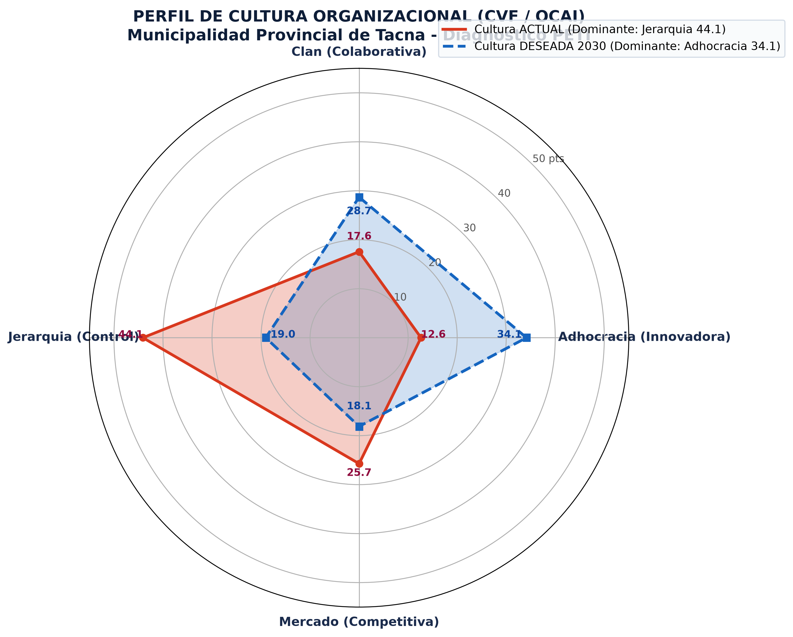

# SI-886 · Planeamiento Estratégico de TI — Taller de Laboratorio 05
## Diagnóstico de Cultura Organizacional con el Competing Values Framework (CVF / OCAI)
### Caso: Municipalidad Provincial de Tacna (MPT)

**Universidad Privada de Tacna**  
**Facultad de Ingeniería · Escuela Profesional de Ingeniería de Sistemas**  
**Docente:** Dr. Oscar Juan Jimenez Flores  
**Estudiante:** GianFranco Arocutipa Arocutipa (Cód. 2023076790)  
**Semestre:** 2026-II  

---

## 📌 Resumen Ejecutivo del Taller

El presente repositorio contiene el desarrollo integral del **Taller 05** del curso **SI-886 (Planeamiento Estratégico de TI)**, orientado al diagnóstico de la cultura organizacional de la **Municipalidad Provincial de Tacna (MPT)** mediante el **Competing Values Framework (CVF / OCAI)** de Cameron & Quinn (2011).

El diagnóstico se fundamentó en los 4 documentos institucionales oficiales de la corporación edil:
1. **Plan Estratégico Institucional (PEI 2025-2030):** Misión, OEI.07 ("Fortalecer el Gobierno Digital") y AEI.07.01 a AEI.07.04.
2. **Organigrama y ROF 2022:** Estructura orgánica con 6 gerencias de línea, 6 oficinas generales y Alta Dirección.
3. **Reglamento Interno de SST (RISST 2024, Versión 02):** Artefacto normativo de 51 páginas que revela la rigidez jerárquica y el enfoque punitivo.
4. **Ley N° 27815:** Ley del Código de Ética de la Función Pública.

---

## 📊 Perfil Cultural de la MPT (Gráfico de Radar)



| Cuadrante CVF | Puntaje ACTUAL | Puntaje DESEADO (2030) | Brecha Neta (Δ) | Diagnóstico Estratégico |
|---|:---:|:---:|:---:|---|
| **Clan (Colaborativa)** | 17.56 pts | 28.70 pts | **+11.14 pts** | Demanda de mejor clima laboral, integración y bienestar |
| **Adhocracia (Innovadora)** | 12.62 pts | 34.14 pts | **+21.52 pts** | **Mayor brecha:** Apetito masivo por modernización y gobierno digital |
| **Mercado (Competitiva)** | 25.72 pts | 18.12 pts | **-7.60 pts** | Reorientación: priorizar valor público sobre multas recaudatorias |
| **Jerarquía (Control Normativo)** | **44.10 pts** | 19.04 pts | **-25.06 pts** | **Cultura dominante actual:** Burocracia y parálisis por temor al OCI |

* **Cultura Dominante Actual:** **Jerarquía (44.10 pts)** con alta congruencia a través de las 6 dimensiones.
* **Cultura Dominante Deseada:** **Adhocracia (34.14 pts)**, reflejando el mandato del PEI 2025-2030 hacia la transformación digital.

---

## 📁 Estructura del Repositorio

```text
├── 02_identidad/                     # Núcleo de identidad estratégica y diagnóstico cultural
│   ├── CU01_instrumento.md          # Especificación del instrumento OCAI (6 dimensiones)
│   ├── encuesta_cultura.csv          # Base de datos bruta (N=35 encuestados)
│   ├── CU02_perfil_cultura.py        # Script en Python de procesamiento y gráfico
│   ├── CU02_perfil_cultura.csv       # Tabla de puntajes y brechas dimensionales
│   ├── CU_perfil_cultura.png         # Gráfico de radar en alta resolución (300 DPI)
│   ├── CU03_supuestos.csv            # Matriz de 6 supuestos básicos y 5 brechas comprobadas
│   ├── CU04_implicancias_peti.md     # Matriz de implicancias y riesgos para el PETI
│   ├── 2.3_valores.md                # Sección oficial 2.3: Valores conductuales y criterios TI
│   └── 2.4_cultura.md                # Sección oficial 2.4: Diagnóstico cultural integral
│
├── documentos_fuente/                # Documentos oficiales de la Municipalidad de Tacna
│   ├── 7700859-pei_escaneo-1.pdf     # PEI 2025-2030 (135 páginas escaneadas)
│   ├── ORGANIGRAMA DEL ROF 2022.pdf  # Organigrama institucional de la MPT
│   ├── reglamento interno...pdf      # RISST 2024 de la MPT (51 páginas)
│   └── ley nro 28715...pdf           # Código de Ética de la Función Pública
│
├── docs/evidencias/S05/salidas/      # Logs y evidencias de ejecución
│   ├── control_calidad.txt           # Reporte de exclusión de encuestas anómalas
│   ├── analisis_perfil.txt           # Perfiles desglosados por gerencia (n >= 5)
│   ├── git_status.txt                # Trazabilidad de control de versiones
│   └── git_log.txt                   # Registro de commits y etiquetas
│
├── anexos/                           # Anexos solicitados por la guía
│   ├── anexo_A_instrumento_cvf.pdf   # Formato PDF del instrumento OCAI
│   ├── anexo_B_resultados_cultura.xlsx # Libro Excel con datos y promedios
│   ├── anexo_C_perfil_cultura.png    # Gráfico de radar a 300 DPI
│   ├── anexo_D_supuestos_basicos.xlsx# Matriz Excel de supuestos básicos
│   └── anexo_E_secciones_2_3_2_4.pdf # Secciones 2.3 y 2.4 consolidadas
│
├── SI886-S05-TALLER-Grupo01.docx      # Informe final editable en plantilla EPIS oficial
└── SI886-S05-TALLER-Grupo01.pdf       # Informe final oficial (11 páginas, exportado de Word)
```

---

## 🏷️ Etiquetas Git (Tags)
- **`v0.5`**: Versión 0.5 del PETI que formaliza la Identidad Estratégica Completa (Secciones 2.3 Valores y 2.4 Cultura).
- **`taller-05`**: Etiqueta oficial del commit calificado para el Taller 05.
